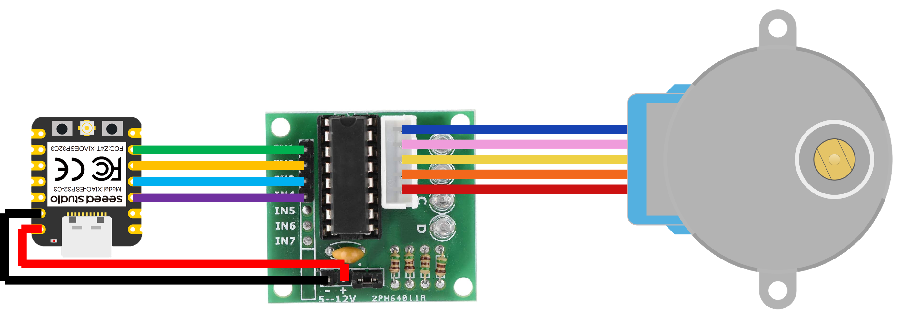
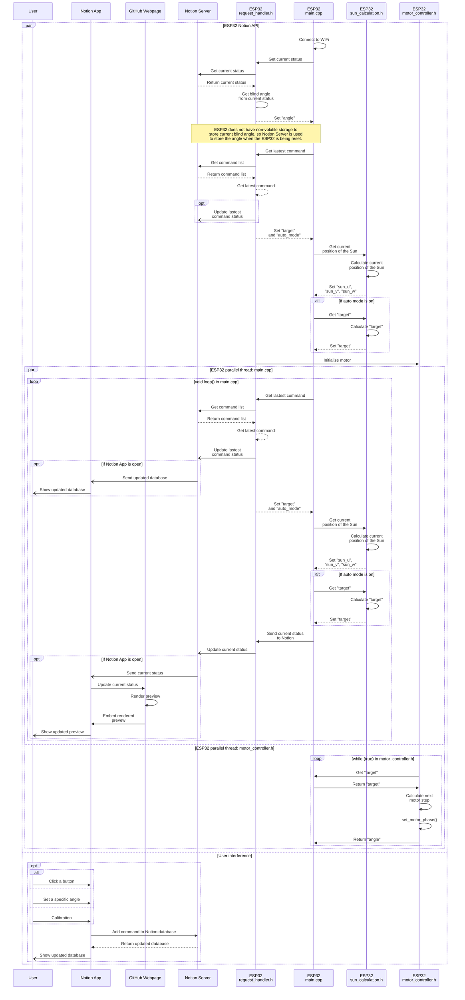

# Auto Blinds

**Auto Blinds** is an automation project that dynamically adjusts blind orientation based on the Sun's position ([Auto Mode](#auto-mode)). It also includes a mobile interface for convenient remote manual control ([Manual Mode](#manual-mode)).

## Preview

### Auto Mode

<p align="center">
    <br>
    <sub>Fig. 1. The blinds adjusts the orientation automatically based on time and the Sun's position.</sub>
</p>

### Manual Mode

<p align="center">
    
    <br>
    <sub>Fig. 2. The blinds are controlled on phones.</sub>
</p>

## Background and Motivation

...

## Basic Information

### Electronics

- **Microcontroller:** Seeed Studio XIAO-ESP32-C3 [^1] [^2]

- **Motor:** 28BYJ-48 stepper motor

- **Language:** C++, Notion API

- **Directory:** [src/](src/)

### User Interface

- **Language:** Notion, HTML, JavaScript, CSS

- **Directory:** [docs/status/](docs/status/)

Note: A Notion page, where there are buttons and Notion database, is used as the interface for users to control the blinds on their phones. A [github webpage](docs/status/) is embedded in the Notion page to provide a real-time preview of the orientation of the blinds and the dynamic position of the Sun.

### Algorithm Tests

- **Language:** Python

- **Directory:** [local_debug/](local_debug/)

## Wiring

<p align="center">
    
    <br>
    <sub>Fig. 3. Auto Blinds wiring diagram</sub>
</p>

## Sequence Diagram



## ENU Analemma Calculation

[Ecliptic coordinate system](https://en.wikipedia.org/w/index.php?title=Ecliptic_coordinate_system&oldid=1338843308) is used to calculate the Sun’s [declination](https://en.wikipedia.org/w/index.php?title=Declination&oldid=1276361201) ($\delta$), where the origin is the center of the Sun, $X$ points to the vernal equinox, $Z$ is the North Ecliptic Pole, and $Y$ completes the right-handed system. Notably, Jean Meeus’s Algorithm [^3] is used to calculate the approximate time of the vernal equinox in this project (also see [local_debug/analemma_ENU.py](/local_debug/analemma_ENU.py#L10-L57)).

Since

$${\hat{r}}_{SE}=\left[
\begin{matrix}
\cos{\\,\lambda_\odot}\\
\sin{\\,\lambda_\odot}\\
0\\
\end{matrix}
\right]
$$

and

$${\hat{n}}_{NCP}=\left[
\begin{matrix}0\\
\sin{\\,\varepsilon}\\
\cos{\\,\varepsilon}\\
\end{matrix}
\right],
$$

we have

$$
\begin{aligned}
\sin{\\,\delta}&=\sin{\left[\frac{\pi}{2}-\angle\left(-{\hat{r}}_{SE},{\hat{n}}_{NCP}\right)\right]}\\
&=\cos{\angle(-{\hat{r}}_{SE},{\hat{n}}_{NCP})}\\
&=\frac{{\hat{n}}_{NCP}\bullet(-{\hat{r}}_{SE})}{\left|{\hat{n}}_{NCP}\right|\left|{\hat{r}}_{SE}\right|}\\
&=-\left[\begin{matrix} \cos{\\,\lambda_\odot}\\\\ \sin{\\,\lambda_\odot}\\\\0\end{matrix}\right]\left[\begin{matrix}0\\\\ \sin{\\,\varepsilon}\\\\ \cos{\\,\varepsilon}\end{matrix}\right]\\
&=-\sin{\\,\lambda_\odot}\\,\sin{\\,\varepsilon}.
\end{aligned}
$$

where:

- ${\hat{r}}_{SE}$ is the unit vector pointing from the Sun to Earth in the ecliptic coordinate system

- ${\hat{n}}_{NCP}$ is the unit vector pointing toward the **north celestial pole (NCP)** in the ecliptic coordinate system

- $\delta$ is the Sun’s declination

- $\lambda_\odot$ is the [ecliptic longitude](https://en.wikipedia.org/w/index.php?title=Ecliptic_coordinate_system&oldid=1338843308) of Earth

- $\varepsilon$ is the obliquity of Earth

Since the [subsolar latitude](https://en.wikipedia.org/w/index.php?title=Subsolar_point&oldid=1334981706) ($\phi_s$) is the same as the Sun’s declination ($\delta$), we have

$$\phi_s=\delta=-\arcsin{(\sin{\\,\lambda_\odot}\\,\sin{\\,\varepsilon})}$$

In the [Earth-centered, Earth-fixed coordinate system](https://en.wikipedia.org/w/index.php?title=Earth-centered,_Earth-fixed_coordinate_system&oldid=1263086982) (ECEF), the subsolar vector (${\hat{u}}_s$) can be calculated as:

$${\hat{u}}_s=\left[\begin{matrix}\\,\cos{(\phi_s)}\\,\cos{(\lambda_s)}\\\\ \cos{(\phi_s)}\\,\sin{(\lambda_s)}\\\\ \sin{(\phi_s)}\\ \end{matrix}\right]$$

where:

- $\phi_s$ is the subsolar latitude
- $\lambda_s$ is the subsolar longitude, which can be calculated according to the current time ($T_{UTC}$) using the following formula [^4]:

$$\lambda_s=-15\\,(T_{UTC}-12)$$

Similarly, the normalized observer vector (${\hat{u}}_o$), which points directly from the center of Earth to the observer, in ECEF coordinate system can be calculated as:

$${\hat{u}}_o=\left[\begin{matrix}\\,\cos{(\phi_o)}\\,\cos{(\lambda_o)}\\\\ \cos{(\phi_o)}\\,\sin{(\lambda_o)}\\\\ \sin{(\phi_o)}\\ \end{matrix}\right]$$

where:

- $\phi_o$ is the latitude of the observer
- $\lambda_o$ is the longitude of the observer

Note: $ϕ_o$ is the [geodetic latitude](https://en.wikipedia.org/wiki/Geodetic_coordinates) of the observer. However, $ϕ_s$ is the [geocentric latitude](https://en.wikipedia.org/wiki/Latitude#Geocentric_latitude) of the Sun, ignoring the [parallax effect](https://en.wikipedia.org/wiki/Parallax).

Then the coordinate system needs to be transformed into the observer’s coordinate system. The [horizontal coordinate system](https://en.wikipedia.org/w/index.php?title=Horizontal_coordinate_system&oldid=1267888614) is commonly used to represent the position of the sun [^4] [^5]. However, since the blinds and the roof edges mentioned in [Background and Motivation](#background-and-motivation) are parallel to the lines of latitude and longitude, we should use the local [east-north-up](https://en.wikipedia.org/w/index.php?title=Local_tangent_plane_coordinates&oldid=1275515987#Local_east,_north,_up_(ENU)_coordinates) (ENU) coordinate system.

The unit vectors of the **ENU** coordinate system **expressed in** the **ECEF** coordinate system ($\hat{u}$, $\hat{v}$ and $\hat{w}$) can be calculated based on the normalized observer vector (${\hat{u}}_o$):

```math
\begin{aligned}
&\hat{u}=\left[\begin{matrix}u_x&u_y&u_z\\\end{matrix}\right]=\left[\begin{matrix}-\sin{(\lambda_o)}&\cos{(\lambda_o)}&0\\\end{matrix}\right],\\
&\hat{v}=\left[\begin{matrix}v_x&v_y&v_z\\\end{matrix}\right]=\left[\begin{matrix}-\sin{(\phi_o)}\,\cos{(\lambda_o)}&-\sin{(\phi_o)}\,\sin{(\lambda_o)}&\cos{(\phi_o)}\\\end{matrix}\right],\\
&\hat{w}=\left[\begin{matrix}w_x&w_y&w_x\\\end{matrix}\right]={{\hat{u}}_o}^T=\left[\begin{matrix}\cos{(\phi_o)}\,\cos{(\lambda_o)}&\cos{(\phi_o)}\,\sin{(\lambda_o)}&\sin{(\phi_o)}\\\end{matrix}\right].
\end{aligned}
```

where:
$\hat{u}$ is the unit vector pointing to the east
$\hat{v}$ is the unit vector pointing to the north
$\hat{w}$ is the unit vector pointing vertically upward
Subsequently, the Rotation Matrix ($R$) of the coordinate system transformation can be expressed as:

```math
R=\left[\begin{matrix}\hat{u}\\\hat{v}\\\hat{w}\\\end{matrix}\right]=\left[\begin{matrix}-\sin{(\lambda_o)}&\cos{(\lambda_o)}&0\\-\sin{(\phi_o)}\,\cos{(\lambda_o)}&-\sin{(\phi_o)}\,\sin{(\lambda_o)}&\cos{(\phi_o)}\\\cos{(\phi_o)}\,\cos{(\lambda_o)}&\cos{(\phi_o)}\,\sin{(\lambda_o)}&\sin{(\phi_o)}\\\end{matrix}\right]
```

Applying the Rotation Matrix ($R$) to the normalized observer vector (${\hat{u}}_o$) gives the subsolar vector in the ENU coordinate system (${\hat{u}}_s\prime$) [^6]:

```math
{\hat{u}}_s\prime=R{\hat{u}}_s=\left[\begin{matrix}-\sin{(\lambda_o)}&\cos{(\lambda_o)}&0\\-\sin{(\phi_o)}\,\cos{(\lambda_o)}&-\sin{(\phi_o)}\,\sin{(\lambda_o)}&\cos{(\phi_o)}\\\cos{(\phi_o)}\,\cos{(\lambda_o)}&\cos{(\phi_o)}\,\sin{(\lambda_o)}&\sin{(\phi_o)}\\\end{matrix}\right]\left[\begin{matrix}\cos{(\phi_s)}\,\cos{(\lambda_s)}\\\cos{(\phi_s)}\,\sin{(\lambda_s)}\\\sin{(\phi_s)}\\\end{matrix}\right]
```

Let

```math
{\hat{u}}_s\prime=\left[\begin{matrix}s_u\\s_v\\s_w\\\end{matrix}\right],
```

then:

```math
\begin{aligned}
&s_u=-\sin(\lambda_o)\,\cos(\phi_s)\,\cos(\lambda_s)+\cos(\lambda_o)\,\cos(\phi_s)\,\sin(\lambda_s),\\
&s_v=-\sin{(\phi_o)}\,\cos{(\lambda_o)}\,\cos{(\phi_s)}\,\cos{(\lambda_s)}-\sin{(\phi_o)}\,\sin{(\lambda_o)}\,\cos{(\phi_s)}\,\sin{(\lambda_s)}+\cos{(\phi_o)}\,\sin{(\phi_s)},\\
&s_w=s_w=\cos{(\phi_o)}\,\cos{(\lambda_o)}\,\cos{(\phi_s)}\,\cos{(\lambda_s)}+\cos{(\phi_o)}\,\sin{(\lambda_o)}\,\cos{(\phi_s)}\,\sin{(\lambda_s)}+\sin{(\phi_o)}\,\sin{(\phi_s)}.
\end{aligned}
```

Finally, $\arccos{(s_u)}$ is used to represent the solar altitude angle ($a_s\prime$) in the $uw$-plane:

```math
a_s\prime = 
\begin{cases} 
\arccos(s_u) & \text{if } s_w \ge 0\\
-\arccos(s_u) & \text{if } s_w < 0 
\end{cases}
```

## Blind Orientation Calculation

After the Sun rises from the top of the building, the blind target orientation ($θ$) is calculated to block the sunlight.

For simplicity, we let $α$ equal the solar altitude angle ($a_s'$) in the uw-plane and $β$ equal the complementary angle of the blind target orientation ($θ$) in Fig. 4.

<p align="center">
    
    <br>
    <sub>Fig. 4. A vertical cross section of the blinds and the sunlight.</sub>
</p>

In Fig. 4, The sunlight is represented by the red line with an arrow, and the cross section of the blinds is represented by the tilted black lines. $AC$ and $BC$ are constants, where $AC$ is the width of a blind and $BC$ is the vertical distance between two blinds.

According to the geometric relations, we have

```math
\begin{aligned}
\angle ABC=\frac{\pi}{2}-\alpha\\
\angle ACB=\beta
\end{aligned}
```

Based on the sum of the interior angles of triangle ABC,

```math
\angle BAC=\pi-\angle ABC-\angle ACB=\frac{\pi}{2}+\alpha-\beta
```

Applying the Law of Sines in triangle ABC,

```math
\frac{BC}{\sin{\left(\frac{\pi}{2}+\alpha-\beta\right)}}=\frac{AC}{\sin{\left(\frac{\pi}{2}-\alpha\right)}}
```

Therefore,

```math
\cos{\left(\alpha-\beta\right)}=\frac{BC}{AC}\cos{\left(\alpha\right)}
```

In this case, $\beta>\alpha$, so

```math
\begin{aligned}
\beta-\alpha=\arccos{\left(\frac{BC}{AC}\cos{\left(\alpha\right)}\right)}\\
\beta=\arccos{\left(\frac{BC}{AC}\cos{\left(\alpha\right)}\right)}-\alpha
\end{aligned}
```

Finally, since $\beta$ equals the complementary angle of the blind target orientation ($\theta$), we have

```math
\theta=\pi-\beta=\pi-\arccos{\left(\frac{BC}{AC}\cos{\left(\alpha\right)}\right)}+\alpha
```

### References

[^1]: “Getting Started with Seeed Studio XIAO ESP32C3 | Seeed Studio Wiki.” Accessed: Feb. 27, 2026. [Online]. Available: https://wiki.seeedstudio.com/XIAO_ESP32C3_Getting_Started/

[^2]: “Amazon.com: Seeed Studio XIAO ESP32C3 - Tiny MCU Board with Wi-Fi and BLE for IoT Controlling Scenarios. Microcontroller with Battery Charge, Power Efficient, and Rich Interface for Tiny Machine Learning. … : Electronics.” Accessed: Feb. 27, 2026. [Online]. Available: https://www.amazon.com/gp/product/B0B94JZ2YF/?th=1

[^3]: J. H. Meeus, [*Astronomical algorithms*](https://dl.acm.org/doi/abs/10.5555/532892). Willmann-Bell, Incorporated, 1991.

[^4]: T. Zhang, P. W. Stackhouse Jr, B. Macpherson, and J. C. Mikovitz, [“A solar azimuth formula that renders circumstantial treatment unnecessary without compromising mathematical rigor: Mathematical setup, application and extension of a formula based on the subsolar point and atan2 function,”](https://www.sciencedirect.com/science/article/pii/S0960148121004031) *Renew. Energy*, vol. 172, pp. 1333–1340, 2021.

[^5]: R. Walraven, [“Calculating the position of the sun,”](https://www.sciencedirect.com/science/article/pii/0038092X7890155X) *Sol. Energy*, vol. 20, no. 5, pp. 393–397, 1978.

[^6]: “Geographic coordinate conversion,” *Wikipedia*. Dec. 22, 2025. Accessed: Mar. 04, 2026. [Online]. Available: https://en.wikipedia.org/w/index.php?title=Geographic_coordinate_conversion&oldid=1328905303#From_ECEF_to_ENU
